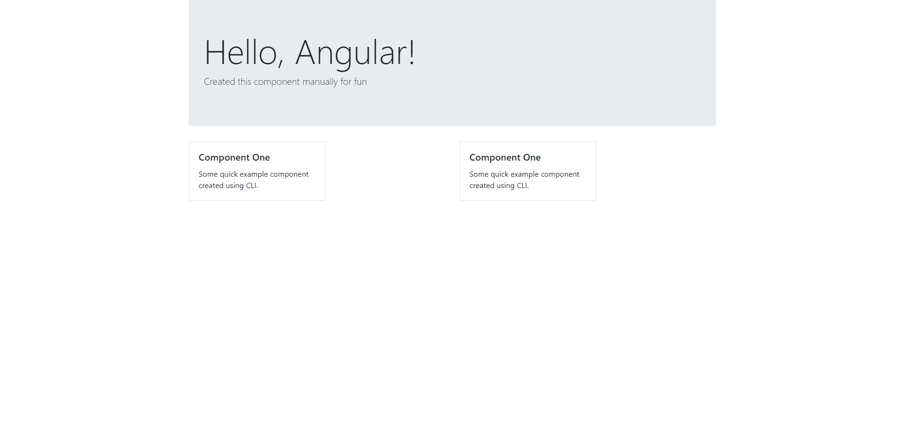

## Task 1

• Create a basic Angular application using Angular CLI  
• Install and configure bootstrap in the Angular app created  
• Clear App component (use container style from bootstrap to wrap content inside app component)  
• Create a new component manually (use bootstrap jumbotron style)  
• Create a new component with cli (use bootstrap card style)  
• Use the two components in App component  
• Use (or explore) bootstrap styles (button etc.)  

